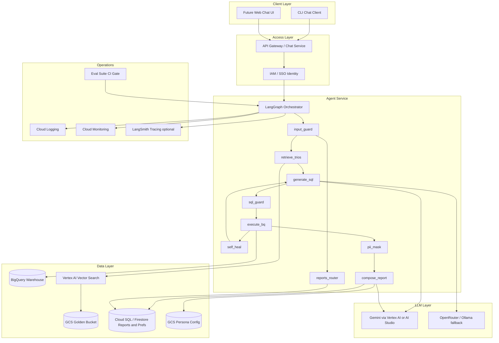
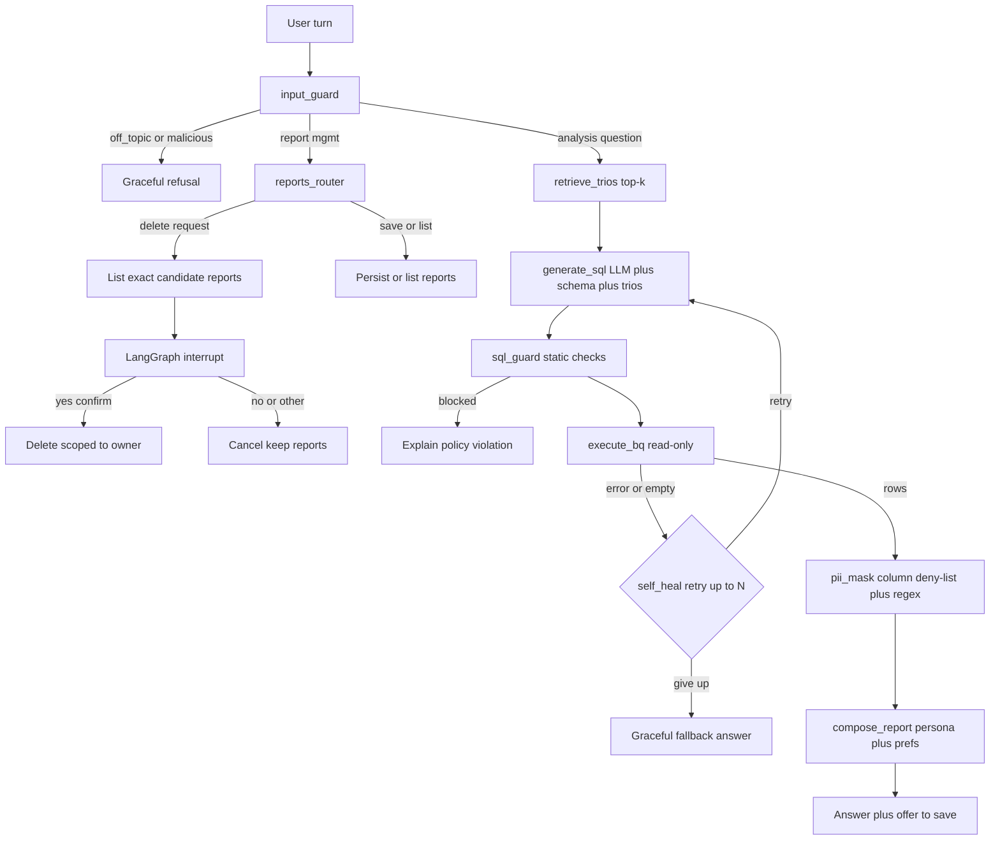
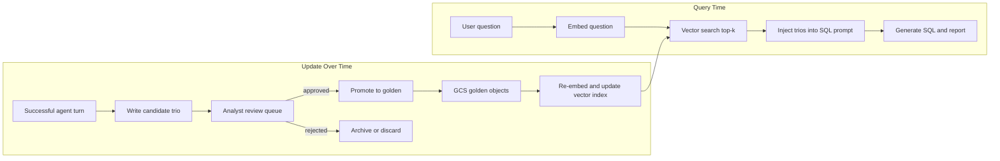

# Architecture — Retail Data Analysis Chat Assistant

This document describes the **production** High-Level Design (HLD) for an internal data-analysis chat agent used by retail executives (Store and Regional Managers). A working CLI prototype implements the same logical architecture locally; differences between prototype and production are called out explicitly.

## Problem and goals

Executives ask complex natural-language questions about sales, inventory and branch performance (for example: *"Why is branch X underperforming and how does it compare to branch Y?"*). The system must:

- Answer with analyst-grade reports backed by live SQL against the company data warehouse.
- Ground answers in expert-approved historical patterns stored in a **Golden Knowledge Bucket** (Question → SQL → Analyst Report "Trios").
- Enforce safety (PII never shown, read-only data access, guarded destructive actions).
- Learn per-user format preferences and improve system-wide over time.
- Fail gracefully, be observable, evaluable before deployment, and allow non-developers to change report tone without redeployment.

## Data sources

| Source | Role | Production | Prototype |
|--------|------|------------|-----------|
| **Data warehouse** | Read-only SQL over transaction logs | BigQuery (company project) | BigQuery public dataset `bigquery-public-data.thelook_ecommerce` |
| **Allowed tables** | Schema boundary | `orders`, `order_items`, `products`, `users` | Same four tables |
| **Golden Bucket** | Few-shot/RAG grounding for SQL and report style | GCS object store + vector index | Local `golden_bucket/` files + in-memory embeddings |
| **Saved reports** | User-owned report library | Cloud SQL or Firestore | SQLite |
| **User preferences** | Per-manager output format | Cloud SQL or Firestore | SQLite |
| **Personas** | Report tone/instructions | GCS or CMS-backed config | Hot-read text/YAML files in `personas/` |
| **Interaction log** | System learning, observability, eval baselines | Cloud Logging + GCS JSONL archive | Local JSONL + optional LangSmith |

## Production system diagram

### Component responsibilities

| Component | Responsibility |
|-----------|----------------|
| **Chat client** | Sends user turns; displays reports; handles confirmation replies for destructive ops. Prototype: Python CLI REPL. |
| **API Gateway / Chat Service** | Authenticates users, rate-limits, routes turns to the agent service, persists thread IDs. |
| **LangGraph Orchestrator** | Explicit state machine: nodes, conditional edges (self-heal loop), `interrupt()` for delete confirmation, checkpointer for conversation memory. |
| **input_guard** | Classifies turns: analysis question, report management, off-topic, malicious (injection, PII fishing). Refusals exit early without BigQuery cost. |
| **reports_router** | Save, list, delete saved reports. Delete resolves candidates scoped to `owner = current_user`, lists exact matches, then pauses for confirmation. |
| **retrieve_trios** | Top-k similarity search over Golden Bucket question embeddings; keyword fallback if embedding API is down. |
| **generate_sql** | LLM generates SQL using schema context + retrieved trios + conversation history. |
| **sql_guard** | Deterministic pre-execution checks: single statement, SELECT-only, allowed tables only, LIMIT injection, `maximum_bytes_billed` cap. |
| **execute_bq** | Runs guarded SQL via BigQuery client; returns rows or typed errors. |
| **self_heal** | On SQL error or empty result, feeds error + prior SQL back to LLM; max N retries (default 2); then graceful fallback message. |
| **pii_mask** | Deterministic masking on DataFrame columns and final report text — never trust the LLM for PII. |
| **compose_report** | LLM composes analyst-style answer using masked rows, persona file, and user format preferences. |
| **Golden Bucket + vector index** | Stores curated Trios; embeddings indexed for query-time retrieval; curation pipeline promotes analyst-approved candidates. |
| **Reports & preferences store** | Owner-scoped saved reports; per-user format preferences (tables vs bullets). |
| **Persona store** | Runtime-editable tone instructions; hot-read each turn — no redeploy. |
| **Observability stack** | Structured events per node; metrics dashboards; optional LangSmith for deep traces. |
| **Eval runner** | Pre-deploy gate: capability cases, safety cases, LLM-as-judge intent scoring. |

## Agent turn flow

Every analysis question follows an explicit graph. Report-management and refusal paths branch early.

### Design principles

1. **Determinism where it matters** — SQL guard, PII masking, and report ownership checks are code, not prompts.
2. **Every failure path has a user-facing sentence** — no stack traces in chat.
3. **Bounded loops and budgets** — self-heal capped at N retries; LLM call cap per turn controls cost.
4. **Assets over code** — personas, golden trios, and eval cases are editable files/objects, not redeploys.
5. **Defense in depth** — even on a read-only public dataset, production ships the same guardrails.

## Golden Bucket lifecycle

The Golden Bucket is both a **retrieval source at query time** and a **curated knowledge base that grows over time**.

**Query-time retrieval:** When a manager asks a question, the system embeds the question, retrieves the top-k most similar curated Trios from the vector index, and injects them as few-shot examples into the SQL-generation prompt. This teaches the model how analysts previously interpreted similar questions.

**Update over time:** After a successful turn, the system captures a **candidate trio** (question, SQL, report excerpt) to a review queue — not directly into golden. Data analysts curate candidates: approve (promote to golden, re-index), edit-then-approve, or reject. This keeps the bucket high-quality and prevents bad agent outputs from polluting expert knowledge.

**Prototype vs production:** The prototype stores seed trios as local files, embeds at startup, and appends candidates to a local folder/JSONL. The production pipeline uses GCS, Vertex AI Vector Search, and an analyst review UI or ticket queue.

## Prototype vs production mapping

| Concern | Prototype | Production |
|---------|-----------|------------|
| Chat interface | CLI REPL (`python -m retail_agent.cli`) | API Gateway + web/mobile client |
| Identity | `--user` CLI flag | SSO / IAM |
| LangGraph | In-process Python graph | Containerized agent service (Cloud Run / GKE) |
| LLM | Gemini via AI Studio API key | Vertex AI Gemini with quota management |
| LLM fallback | Optional OpenRouter / Ollama | Managed secondary provider or model router |
| BigQuery | Public `thelook_ecommerce` dataset | Company BigQuery project |
| Golden Bucket | Local files + in-memory embeddings | GCS + Vertex AI Vector Search |
| Saved reports / prefs | SQLite | Cloud SQL or Firestore |
| Personas | Local `personas/` hot-read files | GCS objects or CMS |
| Observability | JSONL event log + optional LangSmith | Cloud Logging, Monitoring, alerting |
| Eval gate | Local pytest + eval runner | CI pipeline blocking deploy |
| Conversation memory | LangGraph SQLite/in-memory checkpointer | Managed checkpointer backing store |

## Extensibility

### Prototype: in-process LangGraph nodes

Adding a capability in the prototype means adding a **new node or tool** and wiring an edge in the graph — for example, a `generate_chart` node after `pii_mask`, or an `email_report` node after `compose_report`. Everything runs in one Python process; no separate servers. This keeps the prototype **simple and working**, which is the assignment's explicit constraint.

### Production: MCP as the tool-integration mechanism

In production, reusable capabilities are exposed as **MCP (Model Context Protocol) servers** so any agent or MCP client can call them with the same safety guarantees:

| MCP server (example) | Exposed capability | Safety boundary |
|----------------------|-------------------|-----------------|
| `retail-query` | Guarded BigQuery SQL execution | `sql_guard` + `pii_mask` enforced server-side |
| `golden-retrieval` | Read-only trio search | No write path without curation auth |
| `reports-library` | Save/list/delete (with confirmation protocol) | Owner-scoped; delete requires explicit confirm token |

**Why MCP in production:** New data sources (inventory API, CRM, regional spreadsheets) plug in as new MCP servers without changing the agent graph core. Other internal agents (procurement bot, finance assistant) reuse the same guarded BigQuery and Golden Bucket servers. Tool contracts are versioned and testable independently.

**Why not MCP in the prototype:** MCP adds process management, transport setup, and client registration overhead. The assignment prioritizes a working end-to-end demo over integration plumbing. The HLD documents MCP so production teams know the intended extension path; an optional follow-up can demonstrate a thin MCP wrapper over existing modules without changing prototype behavior.

### Future capabilities (same extension model)

| Capability | Prototype approach | Production approach |
|------------|-------------------|---------------------|
| Chart generation | New graph node calling matplotlib/plotly | MCP `chart-server` or inline tool |
| Email reports | New graph node + SMTP/API call | MCP `notify-server` + Cloud Tasks |
| New data source | New allowed tables in sql_guard + schema prompt | New MCP server + federated query layer |
| Scheduled reports | Out of prototype scope | Cloud Scheduler + agent batch job |

## Data flow summary

1. **Ingress:** User message → authenticated chat service → LangGraph thread state updated.
2. **Classification:** `input_guard` routes to analysis, report management, or refusal.
3. **Grounding:** `retrieve_trios` fetches top-k expert Trios from vector index (GCS-backed).
4. **Generation:** LLM produces SQL using schema + trios + conversation context.
5. **Safety gate:** `sql_guard` validates SQL before any BigQuery job is submitted.
6. **Execution:** BigQuery returns rows; errors trigger self-heal loop (bounded).
7. **PII:** `pii_mask` scrubs DataFrame and final text deterministically.
8. **Composition:** LLM writes report using persona + user prefs; offer to save.
9. **Egress:** Response to client; structured observability event emitted per node.
10. **Learning:** Successful turns optionally capture candidate trios for analyst curation.

## Security and compliance notes

- **Read-only warehouse:** No DML/DDL; sql_guard rejects multi-statement and non-allowed tables.
- **PII:** Customer emails and phones are masked in output even if SQL selects them; prompts are advisory only.
- **Destructive ops:** Saved-report deletes require explicit confirmation after listing exact targets; cross-user deletion is impossible by design.
- **Cost control:** `maximum_bytes_billed`, mandatory LIMIT, per-turn LLM call budget, early exit on guard refusals.
- **Audit:** Every node emits structured events (turn id, user, SQL, error class, retry count) for compliance review.

## Related documentation

- [Technical Explanation](./TECHNICAL_EXPLANATION.md) — technology choices, error handling, setup overview, and requirement-by-requirement design.
