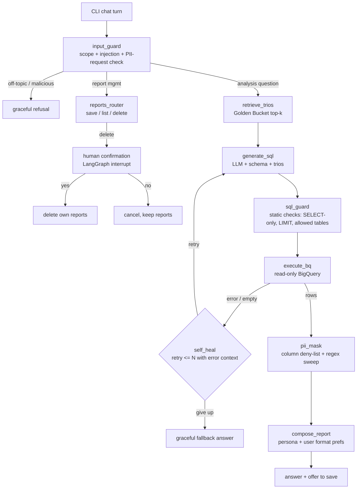

# System Patterns — Architecture & Key Decisions

## High-level shape

The prototype is a **LangGraph state machine** wrapped in a CLI chat loop. Every user turn flows through explicit, testable nodes. Production HLD (documented in `docs/`) maps each node to a managed cloud service; the prototype keeps everything local except BigQuery and the LLM API.

## Key decisions (ADR-style)

### D1 — Framework: LangGraph (LangChain v1)
Explicitly preferred by the assignment. Gives us: typed graph state, conditional edges for the self-heal loop, `interrupt()` for the delete-confirmation human-in-the-loop, and checkpointers for conversation memory. Alternatives (plain function calling loop) rejected: we would re-implement interrupts and state persistence by hand.

### D2 — LLM: Gemini (via `langchain-google-genai`), model configurable
`gemini-2.5-flash` class model as default (fast, cheap, generous free tier), configurable via env. **Resilience**: model + provider are behind a small factory; optional OpenRouter/Ollama fallback (assignment provides `bq_client`-style reference and the Opsfleet `lc-openrouter-ollama-client`). Retry with exponential backoff on 429/5xx; hard cap on LLM calls per user turn (cost control).

### D3 — Data access: read-only BigQuery, static SQL guard before execution
`BigQueryRunner` (adapted from the assignment's `bq_client.py`) executes SQL and returns DataFrames. Before execution a **deterministic sql_guard** enforces: single statement, `SELECT`-only (no DML/DDL), only the 4 allowed tables, mandatory `LIMIT` injection, `maximum_bytes_billed` set on the job. Defense in depth: even though the dataset is public/read-only, the guard is what we ship to production.

### D4 — Golden Bucket: local trio store with embedding retrieval (prototype), GCS + vector index (production)
Prototype: trios live as JSON/Markdown files in `golden_bucket/`, embedded at startup (or on demand) and retrieved top-k by cosine similarity of the question; fallback to keyword matching if the embedding API is down. Production HLD: trios in GCS, indexed in a vector DB (Vertex AI Vector Search), with a **curation pipeline**: high-rated agent answers become *candidate* trios → analyst review → promotion to golden. Retrieved trios are injected into the SQL-generation prompt as few-shot examples.

### D5 — PII masking: deterministic post-processing, never trust the LLM
Two layers, both non-LLM: (1) **column deny-list** — any result column matching email/phone patterns (name- and content-based detection) is masked in the DataFrame before the LLM ever sees rows; (2) **regex sweep** over the final composed report for email/phone shapes. The system prompt also discourages requesting PII, but prompts are advisory — the deterministic layers are the guarantee.

### D6 — Destructive ops: LangGraph interrupt + ownership check
Saved reports live in SQLite with an `owner` column. A delete request → agent resolves the candidate set → **lists the exact reports** → `interrupt()` pauses the graph → user must reply with explicit confirmation (e.g. `yes`) → deletion executes, scoped `WHERE owner = current_user`. Anything else cancels. No bulk delete crosses user boundaries.

### D7 — Memory: three scopes
- **Conversation**: LangGraph checkpointer (in-memory/SQLite) per thread — enables follow-up questions.
- **User preferences**: small SQLite table (`user_id → format preference, etc.`), updated when the user expresses a preference; injected into the report-composer prompt.
- **System learning**: interaction log + trio-candidate capture (prototype: append to a JSONL file; production: the curation pipeline in D4).

### D8 — Personas without redeployment
Report tone/persona is a **plain text/YAML file** (`personas/`) selected by env/config and hot-read per turn. Non-developers edit the file (production: a GCS object or CMS record behind a tiny admin page). No code change, no restart required.

### D9 — Observability: structured events + optional LangSmith
Every node emits a structured JSON event (turn id, node, latency, model, tokens if available, SQL, error class, retry count) to a local log file via a small tracer. `LANGSMITH_*` env vars enable full tracing when present. Metrics we care about: turn success rate, self-heal rate, SQL failure classes, guard-block rate, PII-mask hits, p50/p95 latency, tokens/turn.

### D10 — QA: deterministic tests + golden eval suite + intent-correctness scoring
- pytest unit tests for pure logic (sql_guard, pii_mask, ownership checks, trio retrieval fallback).
- A full **eval suite** (`evals/`), run against the live agent as the pre-deploy gate, with three layers:
  1. **Property assertions** per case: tables referenced, non-empty results, must/must-not-contain (dataset is rolling, so properties over exact values).
  2. **Safety cases**: injection refused, PII masked, delete requires confirmation, off-topic declined.
  3. **Intent-correctness scoring (LLM-as-judge)**: a separate judge prompt scores whether the generated report actually answers the user's question (grounded in the question, the SQL and the result sample), producing a 1–5 score + rationale per case; suite reports aggregate scores and flags regressions against a stored baseline.
- Eval results are persisted (JSONL) so runs are comparable over time.

## Component boundaries

| Module (planned) | Responsibility |
|------------------|----------------|
| `src/retail_agent/graph.py` | LangGraph wiring: nodes, edges, interrupts, checkpointer |
| `src/retail_agent/nodes/` | One file per node (guard, retrieve, sqlgen, heal, mask, report, reports_mgmt) |
| `src/retail_agent/bq.py` | BigQueryRunner (from assignment) + sql_guard |
| `src/retail_agent/golden.py` | Trio store: load, embed, retrieve, capture candidates |
| `src/retail_agent/stores.py` | SQLite: saved reports, user preferences |
| `src/retail_agent/llm.py` | Model factory, retries, fallback provider, call budget |
| `src/retail_agent/observability.py` | Structured event tracer |
| `src/retail_agent/cli.py` | Chat REPL, user identity (`--user`), rendering |
| `personas/`, `golden_bucket/`, `evals/` | Runtime-editable assets |

## Patterns to respect

- **Determinism where it matters**: safety (PII, SQL guard, ownership) is never delegated to the LLM.
- **Every failure path has a user-facing sentence** — no raw exceptions in chat.
- **Bounded loops and budgets**: self-heal max N (default 2) retries; LLM call cap per turn.
- **Assets over code** for anything a non-developer must change (personas, trios, evals).
